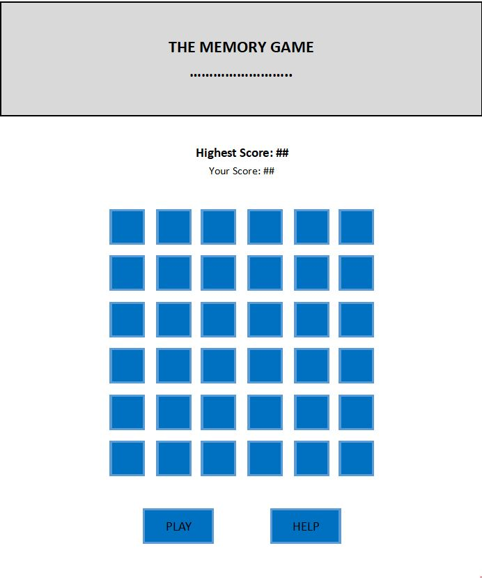

# The Memory Game
Code Institute Interactive Frontend Development Milestone Project

The goal of the game is to remember the buttons that were lit up in the correct order and click them like that. It gets harder by getting a higher score. The higher the score, the more buttons will lit up.

## User Experience
I decided to make this game because it is always fun to test your memory :).

## Technologies Used
1. HTML
2. CSS
3. Bootstrap (4.3.1)
4. jQuery
5. SweetAlert

## Features to be implemented in future
1. Multiplayer game
2. Scoreboard with 10 highest scores

## Content
All content is written by me.
I kept the design very simple with only a few buttons outside the game

### Layout

## Testing
The website is tested on different devices from smartphone to workstation with a 27" screen.
CSS was tested several times on "different devices" using developer tools in different webbrowsers. Using life editing in the webbrowser different settings were tested and improved.

[Freeformatter.com](https://www.freeformatter.com/html-validator.html) was used for code validation. ISO-8859-9 setting was used.

## Deployment
The website is hosted on GitHub pages, directly from the master branch. The deployed site will update automatically upon new commits to the master branch. In order for the site to deploy correctly on GitHub pages, the landing page must be named index.html.

To run locally, you can clone this repository directly into the editor of your choice by pasting git clone https://github.com/AllardL/IFDMilestoneProject.git into your terminal. To cut ties with this GitHub repository, type git remote rm origin into the terminal.

## Media
There was no media used from outside sources.

### This website is only for educational use. 